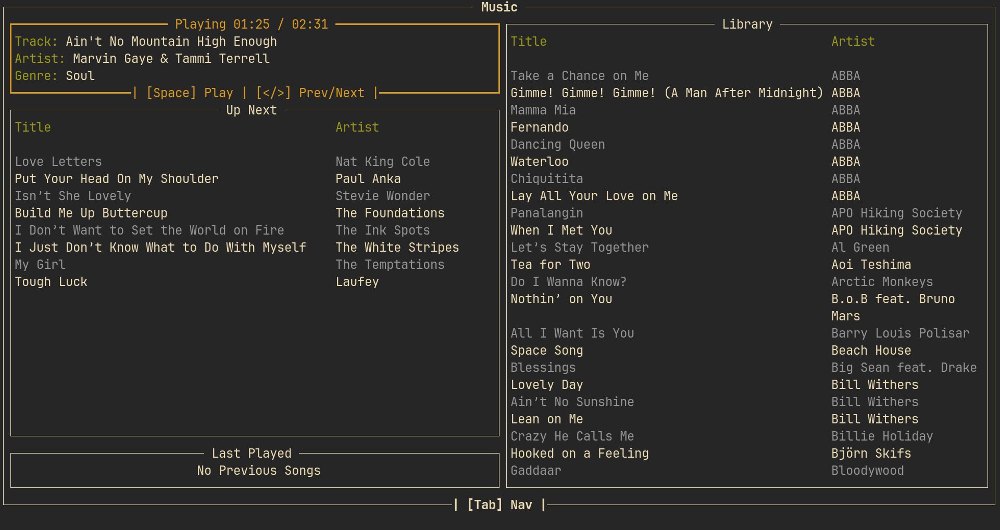

# Auditorium


Auditorium is a cross-platform, local, simple, fast, and distraction free CLI application to listen to your music library



## Features

- Locally fetches song metadata such as genre(s), artist(s), album(s), track number, and title

- Plays tracks with the lightweight MPV background audio player

- Quick navigation with vim-style keybinds

- "Play Later" feature for auto play and "Play All" to play shuffled playlists

- Automatically saves song history to allow song repetition

- Built-in fuzzy finder with category-specific searching 

- Theming support with a hot-reloadable configuration

- Hot-reloadable music directory so you never need to exit the program

- Never requires leaving the terminal or using the mouse (although mouse support is built-in!)

- Optional [MPRIS](https://wiki.archlinux.org/title/MPRIS) support for system-wide control

- Optional cover art support with any terminal-image viewer

- Extremely light memory and CPU usage

___

## Installation

Auditorium can be installed via [cargo](https://doc.rust-lang.org/cargo/getting-started/installation.html):
```bash
# Lighter terminal-only controlled system
cargo install --git https://github.com/nate-craft/auditorium

# Including optional globally-controlled mpris support
cargo install --git https://github.com/nate-craft/auditorium --features mpris

# Including optional covert art support
cargo install --git https://github.com/nate-craft/auditorium --features art

# Including optional globally-controlled mpris support AND cover art
cargo install --git https://github.com/nate-craft/auditorium --features "mpris, art"
```

Auditorium requires [mpv](https://mpv.io/) and [ffmpeg](https://ffmpeg.org/index.html?) to be installed.

___

## Key Binds

### Global

- `Shift+r`       : Reload configuration
- `r`             : Reload music directory
- `Tab/Shift+Tab` : Navigate to next panel

### Player

- `Space`         : Play/Pause current song
- `</>`           : Next/Previous song
- `Left\Right`    : Seek forward/backward

### Up Next

- `Backspace|d`   : Remove from "Up Next"
- `Enter`         : Play now
- `j/k|Up/Down`   : Navigation current selection
- `c`             : Clear "Up Next"

### Library

- `a`             : Add all to "Up Next"
- `/`             : Fuzzy finding search
- `j/k|Up/Down`   : Navigation current selection
- `Enter`         : Add song to "Up Next"

___

## Fuzzy Finder

The built-in fuzzy finder can be activated by pressing `/` or by pressing `Enter` on the search box. It can
accept multiple search queries separated by commas. Any non categorized query will filter on artist and
song title, accepting if it matches either. Otherwise, a category tag must be used.

Examples:

```sh
# Jazz songs by Laufey
genre(Jazz),Laufey
# Any rock song
genre(Rock)
# Everything but Metallica
!Metallica
# Every song, but no rock, metal, nor rap
!genre(Rock),!genre(Metal),!genre(Rap)
# Only Bo Burnham, only 'INSIDE' tracks
Bo Burnham,album(INSIDE)
```

___

## Configuration

Auditorium's configuration can be found at `$XDG_CONFIG_HOME/auditorium/config.json`.  
It can be reloaded at any time with `Shift+R`  

### Color Formatting

Color configuration values can be in the following formats:
```hocon
# Common Names
"color-example": "White"
# Hex
"color-example": "#FFFFFF"
# Indexed
"color-example": "0"
```
